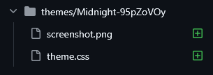

**When submitting this pull request, I confirm the following (please check the boxes):**

- [ ] I have read and understood the [Hydra Themes Docs](https://docs.hydralauncher.gg/themes.html).
- [ ] I have checked that the folder of my theme contains my friend code in the format "My Awesome Theme-<my friend code>".
- [ ] I have checked that the screeshot file has one of the following extensions: png, webp, jpg, jpeg, avif, heic, heif.
- [ ] I have checked that my css file has the extension ".css".
- [ ] I am aware that the validation pipeline needs to pass with success for my theme to be approved.

Good example of how files should be in the PR:

